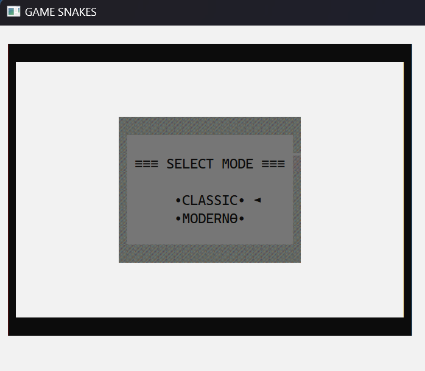
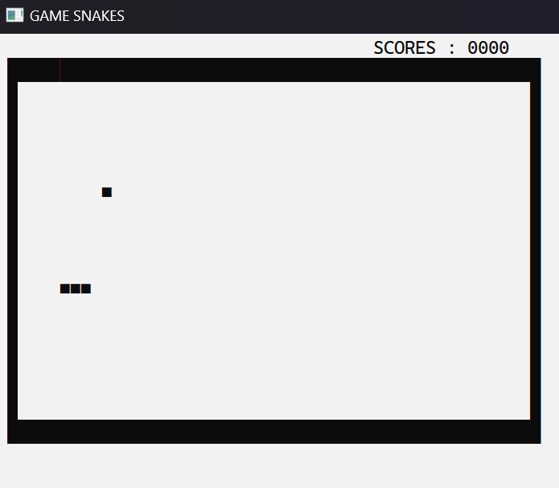
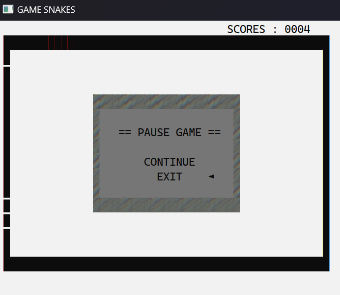
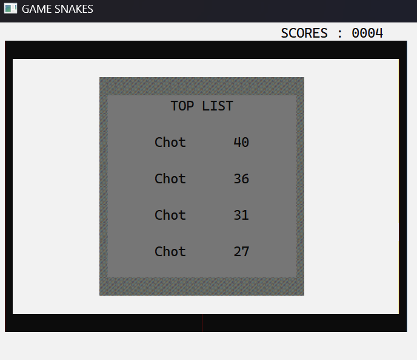
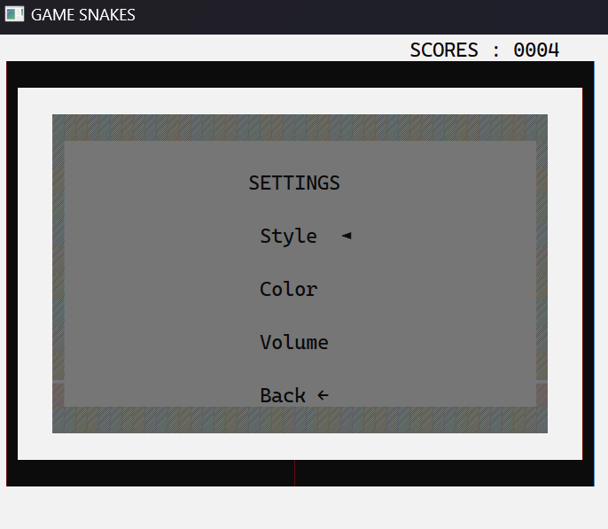
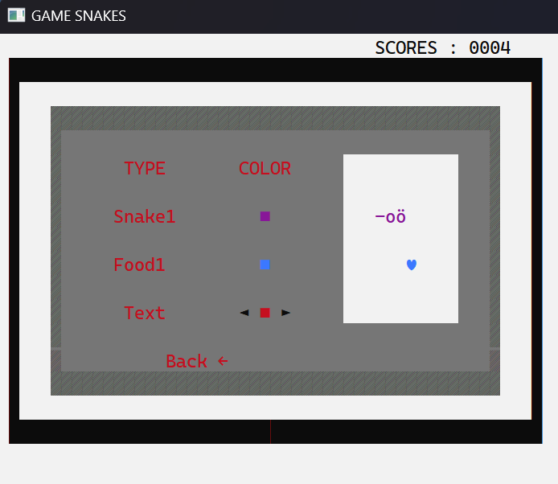
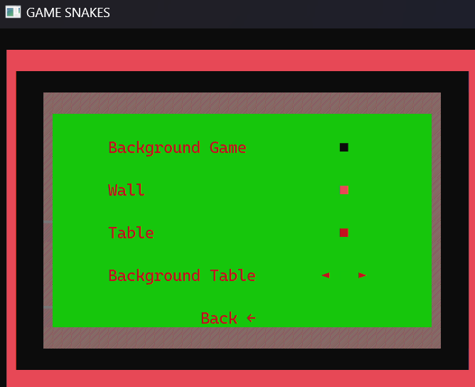
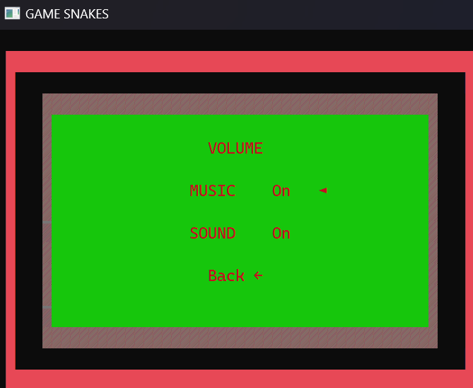

# Snake Game

A classic Snake game implemented in C with a console-based interface. This project demonstrates 
the use of basic programming concepts such as loops, conditionals, and arrays, making it a great 
learning tool for beginners.

## Table of Contents
- [Introduction](https://github.com/Hdchipeo/Snake-game-console/new/main?filename=README.md#introduction)
- [Features](https://github.com/Hdchipeo/Snake-game-console/new/main?filename=README.md#features)
- [Installation](https://github.com/Hdchipeo/Snake-game-console/new/main?filename=README.md#installation)
- [How to Play](https://github.com/Hdchipeo/Snake-game-console/new/main?filename=README.md#how-to-play)
- [Screenshots](https://github.com/Hdchipeo/Snake-game-console/new/main?filename=README.md#screenshots)
- [Contributing](https://github.com/Hdchipeo/Snake-game-console/new/main?filename=README.md#contributing)
- [License](https://github.com/Hdchipeo/Snake-game-console/new/main?filename=README.md#license)
  
## Introduction
The Snake Game is a console-based implementation of the classic Snake game, where the player controls a snake to eat food and grow longer without running into the walls or itself. The game is built purely in C and runs in the terminal/command prompt.

## Features
- Simple controls: Navigate the snake using the arrow keys.
- Score tracking: The game keeps track of your score based on how much food the snake eats.
- Game Over detection: The game ends when the snake collides with itself or the wall.
- Adjustable speed: Modify the speed of the snake for different levels of difficulty.

## Installation
To run the Snake Game, follow these steps:

1. Clone the repository:

bash
Sao chép mã
git clone https://github.com/yourusername/snake-game.git
cd snake-game

2. Compile the code:

Use IDE code::block to build and run with console application. 

## How to Play
- Use the arrow keys (↑, ↓, ←, →) to control the direction of the snake.
- The goal is to eat the food (*) that appears randomly on the screen.
- Every time the snake eats food, it grows longer.
- The game ends if the snake runs into the wall or itself.

## Screenshots
Here are some screenshots of the game in action:

## Game Start

## In-Game

## Game Over

##Top List

##Setting

## Contributing
Contributions are welcome! If you have any ideas for new features or improvements, feel free to submit a pull request or open an issue.

## License
This project is licensed under the MIT License - see the LICENSE file for details.

